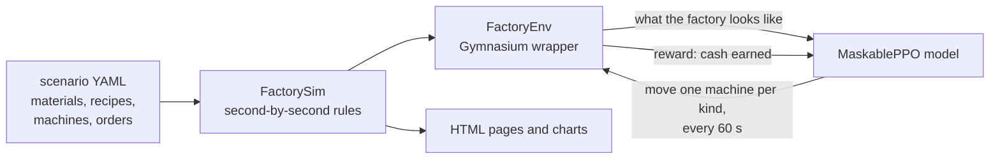

<h1 align="center">sj-rl-factory-schedule</h1>

<p align="center">
  A factory simulator where a reinforcement learning model decides which machine makes what.<br>
  Work in progress: it already beats planners that know only the orders announced so far.
</p>

<p align="center">
  
  
  
  
</p>

<p align="center">
  
</p>

Reinforcement learning (RL) means a program learns by trial and error, guided by a reward score. Here the reward is money earned. Every minute the model may move one machine of each kind to another recipe, and the simulator plays out the next minute. Customers order products with a due time, and an order is paid only if it ships in full; a short order is fined.

This project is still in development. Results so far, on the small lab factory (`scenarios/lab.yaml` and its variants):

| Policy | Light to busy days | Busy days |
|---|---|---|
| **Trained model** (2M decisions on busy days, about 20 minutes) | **88%** | **87%** |
| Planner that re-plans every 5 minutes from the orders announced so far | 86% | 82% |
| Oracle: plans once, knowing every order in advance | 87% | 85% |
| Planner that re-plans every 5 minutes, knowing every order in advance | 91% | 90% |
| Keep: every machine stays on its starting recipe | -22% | -31% |

Numbers are shares of the upper bound, a profit no schedule can beat, over 30 days each (`uv run python -m sjfactory bench`). The model beats every planner that knows only what it knows; only a planner that sees the future does better. The [roadmap](docs/roadmap.md) says what we aim for and what comes next.

## How it works



The model starts out knowing nothing. After about 25k decisions it is far ahead of keep, and it levels off within about 300k:

<p align="center">
  
</p>

The solid line is the model taking its most likely choices. The dashed line is it drawing choices at random, as it does in training. Both end in the same place, so the model really has a plan and is not relying on luck.

This is what the plan looks like on the factory floor: 3 smelters, 3 constructors and 3 assemblers, one colour per recipe.

<p align="center">
  
</p>

The pictures come from one training run on `lab.yaml`; `uv run python scripts/readme_images.py runs/<folder>` redraws them.

All docs start at [docs/README.md](docs/README.md): the [roadmap](docs/roadmap.md), [design](docs/design/README.md) (simulation rules, what the model decides and sees, training) and [experiments](docs/experiments/README.md) (results so far, lessons).
## Run

```bash
uv run python -m sjfactory run --policy keep         # every machine keeps its starting recipe
uv run python -m sjfactory run --policy random
uv run python -m sjfactory --note "what I changed" train --steps 1000000   # MaskablePPO; steps = decisions, one per 60 s
uv run python -m sjfactory eval runs/<folder>/best_model.zip --mode sampled   # or --mode fixed
uv run python -m sjfactory view                      # list of all runs in the browser
uv run python -m sjfactory check                     # machine load, keep, oracle and upper bound in under a minute, no training
uv run python -m sjfactory bench runs/<folder>/best_model.zip   # share of the upper bound on each kind of test day
uv run pytest
```

Global options go before the command, for example `--horizon 1000`, `--seed 3`, `--note "..."`, `--scenario path.yaml` or `--no-open`.

## Looking at results

Every command opens a web page in your browser. The pages are plain files, no server needed, and the charts are interactive: hover for values, drag to zoom, double-click to reset.

- `runs/index.html`: every run, newest first, with the notes you gave. The top chart lays all training runs over each other, so you can see whether a code change helped.
- `runs/<folder>/training.html`: opens as soon as training starts and reloads itself every 15 seconds. The main chart shows the model's profit on fixed test orders against the two fixed rules (keep and random): solid blue takes the model's most likely choices, dashed blue draws them at random as in training. Blue above orange means the model beats the fixed rule. Below it are "learning health" charts, each with a one-line note on what healthy looks like.
- `runs/<folder>/report.html`: one episode in detail: cash over time compared with the fixed rules on the same orders, where the money came from, every order (filled, partly filled, missed), the machine schedule and stock.

`uv run python -m sjfactory view runs/<folder>` rebuilds a run's page, for example after you change the page code.

Each run folder also holds `summary.json`, `history.xlsx`, `dashboard.png`, `gantt.png` and `material_flow.png`. Training runs also save `model.zip` (the last model), `best_model.zip` (best test profit, in either mode), `eval.csv` (every test episode) and `logs/` (`progress.csv` and TensorBoard files).

## Layout

- `scenarios/lab.yaml`: the default factory, small and balanced for quick experiments. A variant file names it as `base:` and lists only what changes: `lab-busy.yaml` (more orders than capacity), `lab-mixed.yaml` (light to busy days), `lab-three.yaml` and `lab-three-downstream.yaml` (a third product that shares parts)
- `scenarios/large/`: the larger factory of experiments 1 to 9, now parked; the tests still use it
- `sjfactory/`: the code (`spec` → `sim` → `env` → `policies`, plus `check`, `lookahead`, `evaluate`, `training`, `recorder`, `plots` and `web` for checking, running and watching)
- `scripts/readme_images.py`: redraws the pictures on this page
- `tests/`: tests

Generated files (`runs/`, `*.png`, `*.xlsx`, `*.zip`) are ignored by git. Don't commit them. The pictures in `docs/images/` are the one exception.